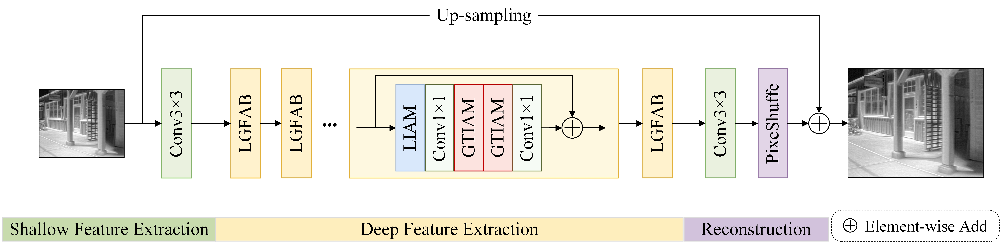

## DFNet-Pytorch
This repository is an official PyTorch implementation of our paper "Local-Global Collaborative Learning for High-Fidelity Infrared Image Super-Resolution".

---

### DFNet: Local-Global Collaborative Learning for High-Fidelity Infrared Image Super-Resolution 


<p align="center">
  
</p>

---

## Prerequisites:
```
1. Python >= 3.6
2. PyTorch >= 1.2
3. numpy
4. skimage
5. imageio
6. tqdm
7. timm
8. einops
```

## Dataset
We used only FLIR dataset to train our model. 

The code and datasets need satisfy the following structures:
```
├── DFNet  					# Train / Test Code
├── dataset  					# all datasets for this code
|  └── FLIR_decoded  		
|  |  └── FLIR_train_HR  		
|  |  └── FLIR_train_LR_bicubic 			
|  └── benchmark  		#  test datasets with png format 
|  |  └── FLIR
|  |  └── Thermal700
|  |  └── Thermal950
 ─────────────────
```


```
  # DFNet x2
  python main.py --scale 2 --model DFNetx2 --patch_size 96 --save experiments/DFNetx2
  
  # DFNet x3
  python main.py --scale 3 --model DFNetx3 --patch_size 144 --save experiments/DFNetx3
  
  # DFNet x4
  python main.py --scale 4 --model DFNetx4 --patch_size 192 --save experiments/DFNetx4
```

## Testing

```
# DFNet x2
python main.py --scale 2 --model DFNetx2 --save test_results/DFNetx2 --pre_train experiments/DFNet/model/model_best_x2.pt --test_only --save_results --data_test Set5

# DFNet x3
python main.py --scale 3 --model DFNetx3 --save test_results/DFNetx3 --pre_train experiments/DFNet/model/model_best_x3.pt --test_only --save_results --data_test Set5

# DFNet x4
python main.py --scale 4 --model DFNetx4 --save test_results/DFNetx4 --pre_train experiments/DFNet/model/model_best_x4.pt --test_only --save_results --data_test Set5


```


## Acknowledgements
This code is built on [CFIN (PyTorch)](https://github.com/24wenjie-li/CFIN)


## :clipboard: Citation

```


```


